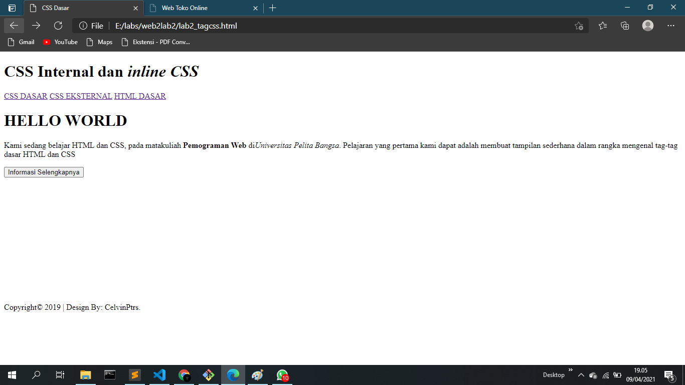
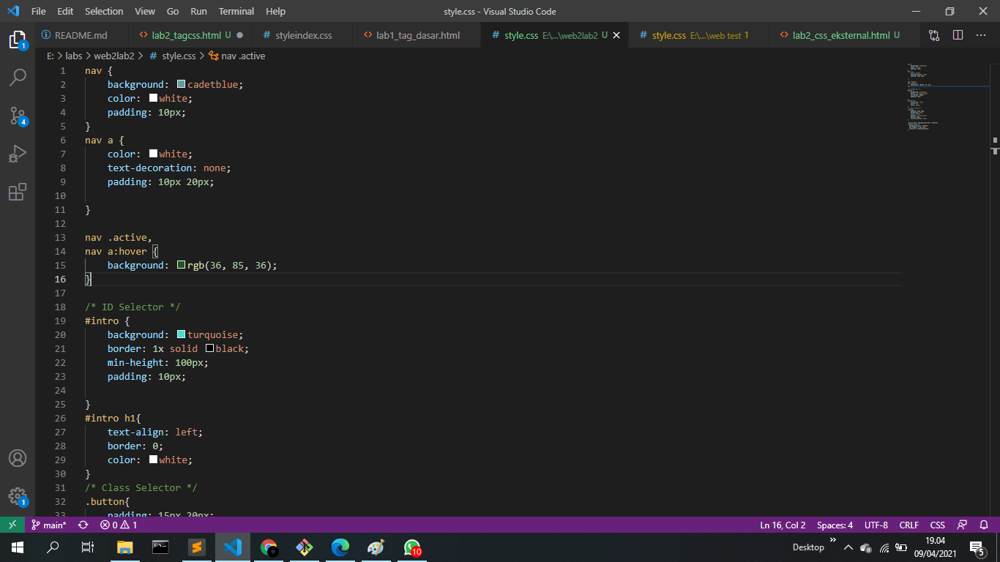
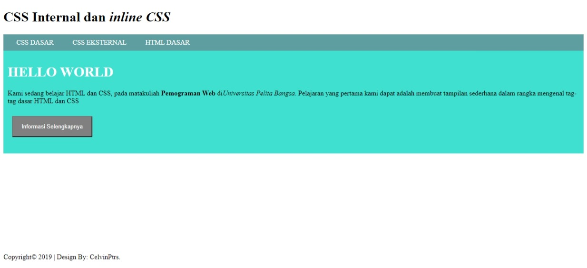

# web2lab2
## Belajar membuat HTML dan CSS

### Menambahkan CSS pada HTML

Pengertian CSS

Cascading Style Sheets atau lebih dikenal dengan CSS adalah bahasa pemrograman desain yang berguna untuk menyederhanakan proses pembuatan website. CSS merupakan bahasa pemrograman yang dipakai untuk mendesain halaman depan atau tampilan website (front end). CSS menangani tampilan dan ‘rasa’ dari halaman website.
Berikut contohnya:

